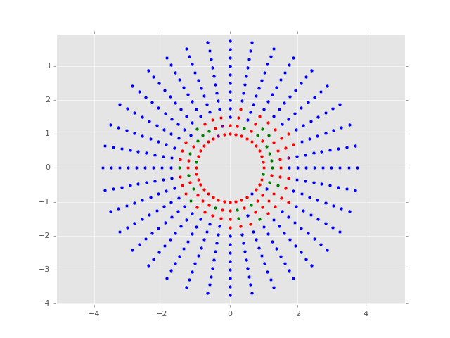

# quicksilver
Python program to easily set up Mercury runs, particularly circumbinary planets.
This program uses Rachel Smullen's [modified version of Mercury](https://github.com/rsmullen/mercury6_binary) for circumbinary planets but will also work for single star systems and unmodified version of Mercury. 
This guide will err on the side of covering basic Mercury information in order to help those using Mercury for the first time.

Setting up runs
===========
Add required files to a new directory

```python
import quicksilver as qs
run = qs.quick("Path_to_directory")
```

quicksilver autoloads the last used settings from the current param.in and mercury.inc
Viewing and changing parameters is as easy as:


```python
print run.algorithm
run.algorithm = 'BS'
print run.algorithm
```

    RADAU
    BS


It is possible to save the current settings and load them at anytime.
They are saved as a numpy arrays with the given name.


```python
print run.binary_separation
run.save_settings('default')
run.binary_separation = 1.0
print run.binary_separation
run.load_settings('default')
print run.binary_separation
```

    0.5
    1.0
    0.5


Adding planets is as easy as


```python
run.add_big(0.001,3.0) # adds a planet of mass 0.001 and semimajor axis of 3
run.add_big(0.001, 4, e=.2, kep_or_mod="Kep", name="SuperEarth", theta=30)
run.add_small(7.0)
```

All planets are currently coplanar but with plans to include inclined orbits in the future. The default intial velocity is given by the modified mean motion according to [Lee & Peale 2006](http://adsabs.harvard.edu/abs/2006Icar..184..573L) but you can specify Keplerian intial velocity if desired. Eccentric orbits are placed at apocenter. Theta is the offset from the planets being aligned with the secondary in degrees. The default name is PL# where number is nth big body added. Similar with small bodies but with the name SM#.


```python
# To make the files
run.build()
```

Running Mercury
-----
Remember to compile the code before each run
```python
remove .out, .dmp, .aie, .clo, .hdf files
compile using gfortran -o mercury6 mercury6_ras.for for example
run mercury6
compile and run close6 & element6
```
I would like to be able to star the runs from python but executing shell command from python is buggy and this way you can have more flexibility with how you start you runs, such as choosing what cores to run Mercury on.

Processing Output
==========
This makes use of the convenient and powerful python [pandas](http://pandas.pydata.org/pandas-docs/stable/) and HDF files. This makes reading and writing incredibly fast.
First convert the .aei files to HDF and convert from central body coordinates to desired coordinates
```
aei2hdf(folder) # converts .aei to HDF
binarybary(folder) # converts to binary barycentric coordinates
jacobi(folder) # coverts to Jacobi coordinates
bary(folder) # converts to absolute barycentric coordinates
```
You can calculate the orbit elements for each coordinate system individually, this isn’t automatically done since it is a very computationally intensive process
```
cal_elements(folder,’coordinate system’)
```
Where ‘coordinate system’ is ‘central’, ’bary’, ‘jacobi’, or ‘totalbary’.

It is possible to read the results of info.out and determine the fate of each body.
```
fates(folder)
```
Reading the files is as easy as:
```
import pandas as pd
p = pd.read_hdf(‘path_to_hdf’,’coordinate system’)
p_fate = pd.read_hdf(‘path_to_hdf’,’fate’)
```
and the information is available as
```
print p.x[0]
p.pomega.plot()
print p_fate.fate.values
```


Miscellaneous
-----
Why is it called quicksilver?

Quicksilver is an archaic name for the liquid metal mercury.

Please acknowledge the use of my code in any publication.

Any feedback is appreciated, especially bugs, suggestions, or possible contributions.

Examples
==========

Cicumbinary stabilty example
-----

```python
from orbitplotting import *
import numpy as np
import matplotlib.pyplot as plt
import pandas as pd
import tables
%matplotlib nbagg
```


```python
folder = "/home/adam/Projects/CBPstab/coolplot/"
a = mercury(folder)
a.primary_mass = .9
a.secondary_mass=.1
a.binary_separation=1.0
a.timestep = 10
a.output_interval = 10*365
a.stop_time = 1000*365
a.max_num_bod = 4000
for d in np.arange(1.0,4,.25):
    for theta in np.arange(0,360,10.0/d):
        #print d, theta
        a.add_small(d, theta=theta)
a.build()
```


```python
folder = "/home/adam/Projects/CBPstab/coolplot/"
hdfs = glob.glob(folder+'*SM*.hdf')
plt.figure()
plt.style.use('ggplot')
for hdf in hdfs:
    p = pd.read_hdf(hdf,"bary")
    fates = pd.read_hdf(hdf,"fate")
    fate = fates.values[0]
    if fate == 'survived':
        plt.scatter(p.x[0], p.y[0])
    if fate == 'ejected':
        plt.scatter(p.x[0], p.y[0], c='r')
    if fate == 'STAR1':
        plt.scatter(p.x[0], p.y[0], c='purple')
    if fate == 'STAR2':
        plt.scatter(p.x[0], p.y[0], c='green')
plt.axis('equal')
plt.show()
```



